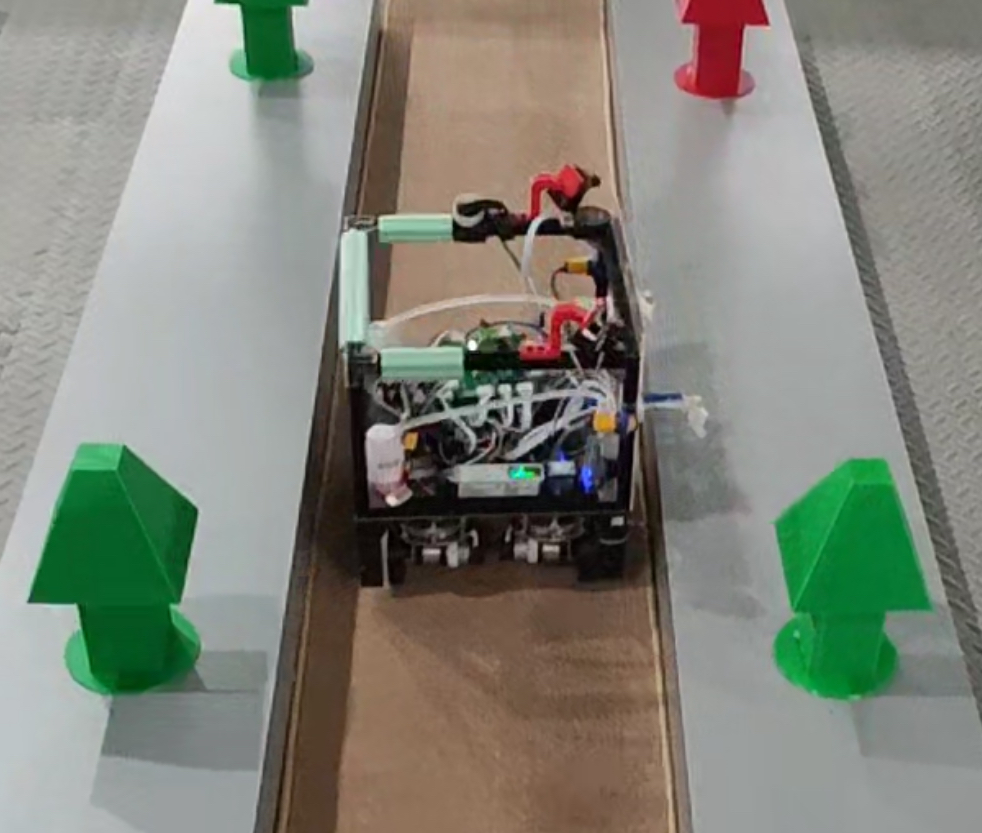
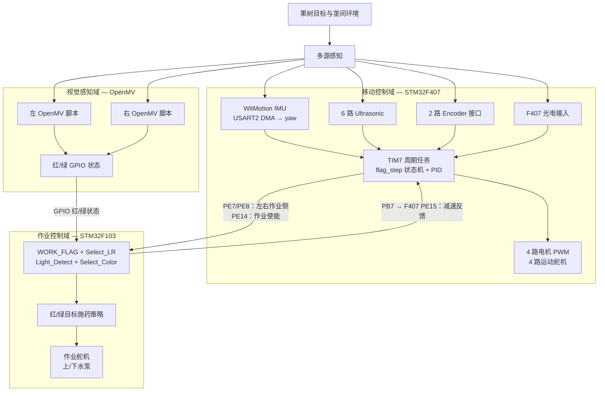
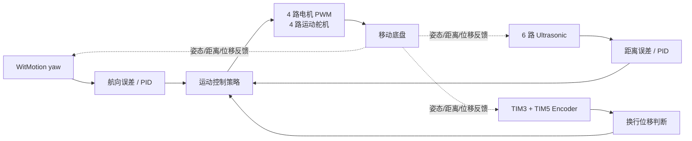
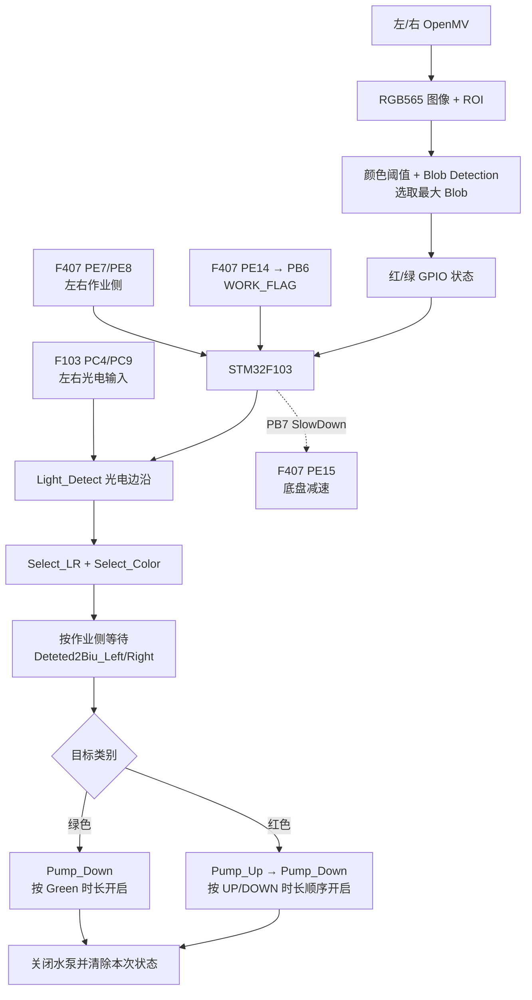

# 果树对靶变量施药机器人

*Fruit Tree Targeted Variable-Rate Application Robot*



## 项目简介

本项目面向果园植保作业场景，设计并实现了一套集自主移动、多传感器环境感知、目标视觉识别与变量施药于一体的农业机器人系统。系统采用 **STM32F407 + STM32F103 双控制器架构**：STM32F407 负责移动底盘、航向保持、行间运动与作业阶段调度，STM32F103 负责接收视觉/光电检测状态并驱动靶向施药机构。

移动底盘通过 **WitMotion IMU、6 路 Ultrasonic、Encoder 以及光电输入**获取姿态、环境距离、位移和行间状态，结合周期任务、作业状态机与 PID 完成前进、减速、换行和方向纠偏。作业端使用左右两个 OpenMV 脚本进行 **RGB565 图像采集、ROI 限定、颜色阈值分割和 Blob Detection**，将红/绿目标状态输出为 GPIO 信号；STM32F103 再根据作业侧、光电触发和目标颜色选择水泵组合及开启时间，实现面向目标类别的定时变量施药。

这个项目的核心不是把传感器简单堆叠在一块控制板上，而是把机器人拆分为三个相互协同的控制环节：

- **STM32F407**：解决机器人怎么移动、怎么保持方向、怎么减速和怎么换行；
- **OpenMV**：解决当前作业侧是否检测到红色/绿色目标；
- **STM32F103 + 水泵/舵机**：解决是否作业、对哪一侧作业以及采用哪一种施药时序。

## 项目亮点

- STM32F407 与 STM32F103 分工明确的双 MCU 分层控制；
- 基于 WitMotion 航向反馈、Ultrasonic 距离和 Encoder 位移的移动控制；
- TIM7 周期任务调度、`flag_step` 作业状态机和多组 PID 控制；
- OpenMV 基于颜色阈值、ROI 和最大 Blob 的轻量级目标识别；
- F407 通过 GPIO 状态信号向 F103 传递左右作业侧与作业使能状态；
- F103 使用光电边沿触发作业，并通过上下水泵的组合与开启时长区分红/绿目标的施药策略；
- 仓库同时保留自研 PCB 工程和 SolidWorks 机械设计资料。

## 技术栈与系统边界

| 子系统 | 已从工程中确认的实现 |
| --- | --- |
| 移动主控 | STM32F407VG、TIM7 周期调度、`flag_step` 状态机、PWM/GPIO |
| 作业控制器 | STM32F103RC、`WORK_FLAG`、左右选择、光电触发、泵/舵机控制 |
| 姿态/航向 | WitMotion 串口数据经 USART2 DMA 接收，解析 yaw；源码中的 `PID_9250_*` 为历史命名 |
| 距离感知 | 6 路 Ultrasonic：左/右侧各两路、前方两路 |
| 位移感知 | 当前 F407 软件初始化并读取 TIM3、TIM5 两路 Encoder 接口 |
| 光电输入 | F407 两路本地行间输入用于运动停行；F103 两路作业光电输入（PC4/PC9）用于目标经过触发 |
| 机器视觉 | 左、右两个 OpenMV 脚本；RGB565、QVGA、ROI、颜色阈值、最大 Blob |
| 底盘执行 | 4 路电机 PWM 与 4 路运动舵机输出 |
| 作业执行 | 1 路当前主循环使用的作业舵机输出、上下两路水泵、光电输入 |
| 工程资料 | PCB 工程压缩包、SolidWorks 零件/装配相关导出文件、STL/DWG/3MF 等 |

## 系统总体架构



当前工程中，F407 与 F103 的实际协同路径是 GPIO 状态信号，而不是已经在主循环中启用的 UART 数据包协议：F407 使用 `PE7/PE8` 表示左右作业侧，使用 `PE14` 表示作业使能；F103 通过 `PB4/PB5/PB6` 读取这些状态，并通过 `PB7` 向 F407 回传减速信号。

## 双控制器协同架构

### STM32F407：移动底盘主控

F407 工程的 `USER/main.c` 完成底盘控制所需外设初始化，`SYSTEM/CONTROL/control.c` 中的 `TIM7_IRQHandler()` 负责周期性调度。当前源码可以恢复出以下职责链：

1. 通过 USART2 DMA 接收姿态串口帧，解析并更新 `yaw`；
2. 通过 6 路 Ultrasonic 获取前方和左右侧距离；
3. 通过 TIM3、TIM5 两路 Encoder 接口读取计数，并在换行流程中使用位移量；
4. 依据 `flag_step` 在前进、减速、左右转向、倒车和出垄等阶段之间切换；
5. 使用距离误差和 yaw 误差选择相应 PID，更新电机速度修正量与运动舵机角度；
6. 在不同作业阶段通过 `PE7/PE8` 选择左右作业侧，在需要时通过 `PE14` 打开作业模式；
7. 读取 F103 通过 `PB7 → PE15` 回传的减速信号，在检测到目标/作业触发后降低底盘速度。

源码中 `Select_Servo_Angle()`、`Select_Motor_Speed()`、`Select_PID()`、`HuanLong()` 和 `ChuLong()` 共同构成移动任务的状态化控制路径。这里的“换行/换垄”是由超声波、光电状态、航向控制和 Encoder 位移共同参与的流程，而不是单一传感器触发的动作。

### STM32F103：靶向施药控制器

F103 工程的 `USER/main.c` 在 `WORK_FLAG` 有效时执行：

```text
WORK_FLAG
  → Select_LR()
  → Light_Detect()
  → servo1(0)
```

其中：

- `Select_LR()` 对 F407 传来的左右作业侧信号进行两次采样确认，形成 `flag_Left/flag_Right`；
- `Light_Detect()` 监测作业板上的左右光电输入，在目标经过时触发一次作业；
- `Select_Color()` 只读取当前作业侧对应的红/绿输入，并形成 `flag_Red/flag_Green`；
- `Water()` 根据目标颜色选择上下水泵的开启组合与持续时间；
- `Clear_RESET()` 在非作业阶段清除颜色状态、复位光电基准并关闭水泵；
- `servo1()` 是当前主循环实际调用的作业舵机位置输出，非作业状态调用 `servo1(270)`，作业状态调用 `servo1(0)`。

因此，F103 不是另一个独立的移动主控，而是一个围绕“作业侧选择—目标触发—施药执行”展开的专用控制器。

### F407 ↔ F103 板间信号

| 逻辑信号 | F407 端 | F103 端 | 代码语义 |
| --- | --- | --- | --- |
| 左作业侧 | `PE7` | `PB4` | `Left_Flag` |
| 右作业侧 | `PE8` | `PB5` | `Right_Flag` |
| 作业使能 | `PE14` | `PB6` | `WORK_FLAG` |
| 减速反馈 | `PE15` | `PB7` | `SlowDown`，由 F103 回传给 F407 |

`Detect_Flag_Mv()` 根据 F407 当前的 `flag_step` 设置左右作业侧信号；`HuanLong()` 在换行作业阶段拉高作业使能；F103 在光电检测到目标后拉高减速输出，F407 的 `Detect_Flag_Slowdown()` 再据此进入减速逻辑。当前代码能够确认的是这组 GPIO 级状态协同，不应把它包装成复杂的双向通信协议。

## 移动底盘控制

### 周期任务与状态机

F407 的 TIM7 中断以周期计数方式组织任务：5 ms 级别执行检测、减速判断、舵机角度选择、电机速度选择和 PID 选择；25 ms 级别触发 Ultrasonic；10 ms 级别发送 yaw 相关数据。`flag_step` 将整车动作拆分为前进、光电停行、左右换行、倒车和出垄等阶段。

### 航向、距离与位移反馈

- **WitMotion 航向反馈**：`HARDWARE/USART2_DMA/usart2_dma.c` 从 USART2 DMA 缓冲区解析 `0x55 0x53` 姿态帧，得到相对起始航向的 `yaw`；
- **距离反馈**：`HARDWARE/ULTRASONIC/` 中维护 `ultra_L1/L2`、`ultra_R1/R2`、`ultra_F1/F2` 六路测距量，并在不同运动阶段选择侧向或前向距离误差；
- **位移反馈**：`HARDWARE/ENCODER/` 当前初始化 TIM3、TIM5 两个 Encoder 接口，`Read_Encoder_Cnt()` 将计数换算为 `Encoders.disA/disB`，主要服务于换行/倒车距离流程；
- **执行输出**：`HARDWARE/MOTOR/` 提供 4 路电机 PWM 与方向控制，`HARDWARE/SERVO/` 当前运动路径使用 4 路舵机 PWM。

旧版说明中的“6 encoders”没有得到当前 F407 软件读取路径的支持。README 采用源码能确认的“两路 Encoder 接口”，不把可能存在的机械配置数量与软件实际读取数量混为一谈。

### 移动控制闭环



## 靶向变量施药

### 变量由什么控制

当前源码所体现的“变量”不是由流量传感器构成的连续流量闭环，而是由以下离散策略共同决定：

1. **目标类别**：OpenMV 输出红色或绿色状态；
2. **作业侧**：F407 通过 `PE7/PE8` 告知 F103 当前执行左侧还是右侧机构；
3. **触发时刻**：F103 的左右光电输入检测到目标经过的边沿后启动一次作业；
4. **泵组合与开启时间**：`Water()` 按红/绿状态控制上、下两路水泵及其延时常量。

在当前 `sow.c` 中，代码逻辑可以概括为：

| 目标状态 | 当前代码中的执行策略 |
| --- | --- |
| 绿色 | 下路水泵开启，保持 `BiuBiu_time_Green` 对应的延时后关闭 |
| 红色 | 上路水泵先开启 `BiuBiu_time_UP` 对应的延时，再开启下路水泵并保持 `BiuBiu_time_DOWN` 对应的延时 |

因此，本项目的变量施药应准确表述为：**基于目标颜色分类的双水泵组合与定时控制**。代码中没有发现流量传感器、压力反馈或基于 Blob 面积连续调节泵时长的闭环；Blob 面积在 OpenMV 中用于筛选有效目标和选取最大 Blob，当前并未直接映射为施药量。

### 靶向施药控制流程



## 机器视觉

仓库中的 `OpenMV/left.txt` 和 `OpenMV/rught.txt` 分别对应左、右作业侧脚本。两份脚本的当前有效路径具有相同的基本结构：

- 使用 `RGB565`、`QVGA` 图像格式，并关闭自动增益和自动白平衡；
- 只在预设 ROI 内搜索目标，减少整幅图像处理范围；
- 使用绿色和红色 Color Threshold 查找 Blob；
- 以 `pixels()` 选择面积最大的候选 Blob；
- 将绿色/红色识别结果通过 GPIO 输出给 F103 的输入端。

当前有效代码不是神经网络、YOLO 或深度学习模型。脚本中虽然保留了 UART 导入和“双目标”相关的注释/变量，但当前工作路径实际使用的是红/绿 GPIO 状态；`double` 输出逻辑没有形成已启用的独立目标类别。

## 自动作业流程

```text
F407 进入对应 flag_step
        ↓
通过 PE7 / PE8 告知 F103 当前左右作业侧
        ↓
在作业阶段通过 PE14 置位 WORK_FLAG
        ↓
F103 读取当前侧 OpenMV 红/绿 GPIO 状态
        ↓
左右光电输入出现目标经过边沿
        ↓
按作业侧延时后执行 Select_Color / Water
        ↓
根据红/绿状态选择上下水泵组合和开启时间
        ↓
F103 通过 PB7 回传减速状态，F407 降低底盘速度
        ↓
关闭水泵、清除本次状态，等待下一目标
```

## 硬件与机械设计

仓库同时包含机器人硬件和机械设计资料：

- `第十届农装PCB工程.epro`：PCB 工程压缩包，内部包含多份 PCB 布局、原理图、封装和符号资源；
- `SW文件/`：包含相机支架、超声波支架、树体/亚克力结构、施药机构以及齿轮、链条、舵机等相关机械设计或导出文件；
- `c4.png`：现有机器人实机/比赛场景图片。

本 README 只描述能够从工程结构和源码中确认的系统关系，不把无法从当前资料完整核实的电路细节、喷头流量或机械尺寸扩展成性能结论。

## 软件结构

目录保持仓库原有组织方式，未对源码进行移动、重命名或重构：

```text
.
├── 正赛主控代码/        # STM32F407 移动底盘主控工程
│   ├── CORE/
│   ├── DMP/
│   ├── FWLIB/
│   ├── HARDWARE/
│   ├── SYSTEM/
│   └── USER/
├── 正赛作业代码/        # STM32F103 靶向施药控制工程
│   ├── CORE/
│   ├── HARDWARE/
│   ├── STM32F10x_FWLib/
│   ├── SYSTEM/
│   └── USER/
├── OpenMV/              # 左/右视觉脚本
├── SW文件/              # 机械设计及导出资料
├── 第十届农装PCB工程.epro # PCB 工程
├── c4.png              # 实机图片
├── README.md
└── LICENSE
```

### F407 工程模块

- `USER/`：启动入口和主循环；
- `SYSTEM/CONTROL/`：TIM7 周期调度、移动任务状态机、行间动作和作业板信号；
- `SYSTEM/PID/`：距离/航向等运动控制器；
- `HARDWARE/MOTOR/`：4 路电机 PWM 与方向控制；
- `HARDWARE/SERVO/`：运动舵机 PWM；
- `HARDWARE/ENCODER/`：TIM3/TIM5 Encoder 接口和位移读取；
- `HARDWARE/ULTRASONIC/`：6 路 Ultrasonic 触发、捕获和滤波；
- `HARDWARE/USART2_DMA/`：姿态串口 DMA 接收与 yaw 解析；
- `HARDWARE/IO/`：本地光电输入及 F407/F103 板间 GPIO。

### F103 工程模块

- `USER/`：作业控制主循环；
- `HARDWARE/SOW/`：左右选择、颜色判断、光电触发、泵控制、作业状态清理；
- `HARDWARE/IO/`：OpenMV 红/绿输入、光电输入、泵输出及板间信号；
- `HARDWARE/PWM/`：作业舵机 PWM；
- `HARDWARE/TIMER/`、`HARDWARE/KEY/`：定时和按键/调试相关功能；
- `HARDWARE/UART/`：仓库中保留的 OpenMV 串口解析模块，当前 `main.c` 未将其接入有效作业主流程。

## 项目演示

[▶ 点击观看果树对靶变量施药机器人实机演示](https://www.bilibili.com/video/BV1MZybBGE1s?vd_source=f2363d1b121157b15409b799183edefd)

## 比赛背景

本项目对应 **“天鹅杯”第十届国际大学生智能农业装备创新大赛 B 类（机器人类）** 的果树对靶变量施药机器人作品。比赛背景资料可参见：[“天鹅杯”第十届国际大学生智能农业装备创新大赛通知](https://uiaec.ujs.edu.cn/news_show.php?id=215)。

## 实现边界与历史命名说明

- F407 工程中存在 `MPU9250`、`MPUIIC`、DMP 以及 `PID_9250_*` 等历史目录、宏和函数名；当前 README 按实际机器人使用的 **WitMotion IMU** 及 `USART2_DMA` 的 yaw 解析路径描述，不修改这些历史命名；
- F407 工程还保留 `wit_c_sdk`、TFLuna 等模块，但它们不能仅凭存在于目录中就视为当前主控制链路的一部分；
- F103 工程保留 TCS3200、JAINSU 以及 OpenMV UART 帧解析等旧/备用模块，当前有效作业主循环使用的是 GPIO 红/绿输入和光电输入；
- 仓库中的历史代码、注释、备用模块和旧工程配置均未在本次工作中清理或重构。

## License

本项目许可证信息请参见仓库中的 [`LICENSE`](./LICENSE) 文件。
